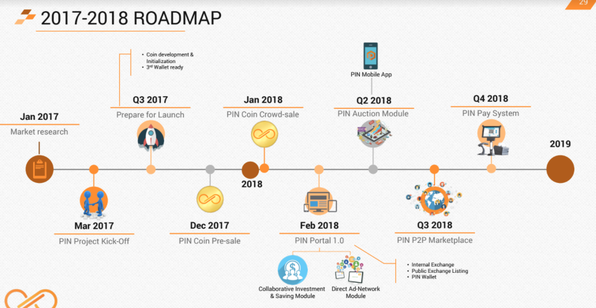

> PinCoin 가입 경로 : [PinCoin 가입 하기](https://my.pincoin.io/dashboard/auth/signup/KWANUNG)
## Welcome to PinCoin

PinCoin에 대해 어려워 하시는 분들 위해 간략한 내용을 담았습니다.

### PinCoin 이란?

> 블럭체인기술을 이용한 **공유경제 커뮤니티** + **렌딩수익** + **네트워크** 가 혼합된  암호화폐 플랫폼.
> 일반 ICO 나 랜딩류 ICO가 아닌 새로운 플랫폼

#### VISION

- PIN 재단은 공유 경제 기반의 기술 플랫폼을 구축하고 홍보하는 비영리 단체입니다.
- 블록체인 기술에 대한 지식뿐만 아니라, 사람들이 공유 커뮤니티에 참여하도록 동기를 부여합니다.
- 플랫폼 구축 3년 후 PIN 커뮤니티를 통해 직간접적으로 연결되는 최소 5백만명의 회원에게 도달하게 됩니다.

#### MISSION

- 글로벌 공유 경제에서 블록체인 기술 및 암호화 통화를 개발하고 홍보하여 사람들을 돕습니다.
- 자산, 자원, 시간 및 기술을 보다 효율적으로 공유할 수 있습니다.
- 공급자와 소비자가 연결될 수 있도록 도와줌으로 써 우리와 커뮤니티가 함께 가치창출, 상거래 합리화 및 시장 접근성 용이성을 향상시키게 합니다.

#### GOAL

- 2017년 출시 및 판매용 PIN coin (ERC20 토큰)
- 2018년 초 공동투자 상품 개발 및 출시
- 2018년 협업 소비 제품의 개발및 출시, 온라인 광고 네트워크에 집중
- 2019년 초 1백만명의 회원 유치

#### PROJECTs

- 협업 투자 포탈 플랫폼 구축
- 트레이딩 시스템
- decentralized 헤지 펀드 조성
- 직접 광고 네트워크 시스템 구축
- PIN용 옥션 
- P2P 마켓 플레이스 
- PINPAY 시스템
- PIN 게임

### ROADMAP

 

### ICO 일정

- 2018년 1월 프리세일 시작
 - 구매금액 : 최소 $100 ~ 최대 $20,000
- 타겟 Price : $1.00

## 네트워크 구성에 따른 보상체계

> 핀코인 안에 여러보상 체계가 있지만 가장중요한것이 랭킹보너스입니다.

- 100만달러 달성시 BMW 스포츠카 시상
- 500만달러 달성시 포르쉐 시상
- 1000만달러 달성시 람보르기니 시상
- 그외 네트워크 수에 따른 보너스 (달러)

### PinCoin 가입 경로 : [PinCoin 가입 하기](https://my.pincoin.io/dashboard/auth/signup/KWANUNG)
